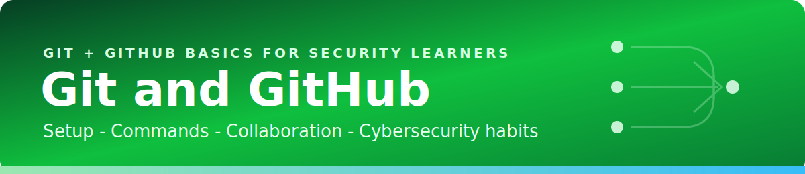

# Resources

[Home](../index.md) | [Notes](../01-notes/README.md) | [Exercises](../02-exercises/README.md) | [Quiz Hub](../03-quiz/index.html) | [Projects](../04-projects/README.md)

## Command Quick Reference

| Task | Command |
| --- | --- |
| Check working tree | `git status` |
| Stage a file | `git add file.md` |
| Commit staged changes | `git commit -m "message"` |
| See history | `git log --oneline --graph --decorate` |
| Create and switch branch | `git switch -c branch-name` |
| Add GitHub remote | `git remote add origin https://github.com/user/repo.git` |
| Push first branch | `git push -u origin main` |
| Pull latest changes | `git pull --ff-only` |

## Security Checklist

- Keep `.env`, keys, tokens, reports with sensitive findings, and raw evidence out of public repos.
- Review `git diff` before every commit.
- Use `.gitignore` before secrets are created, not after.
- Rotate any credential that was committed, even if the commit is later removed.
- Prefer private repos for active investigations, client data, or exploit proof-of-concepts.
